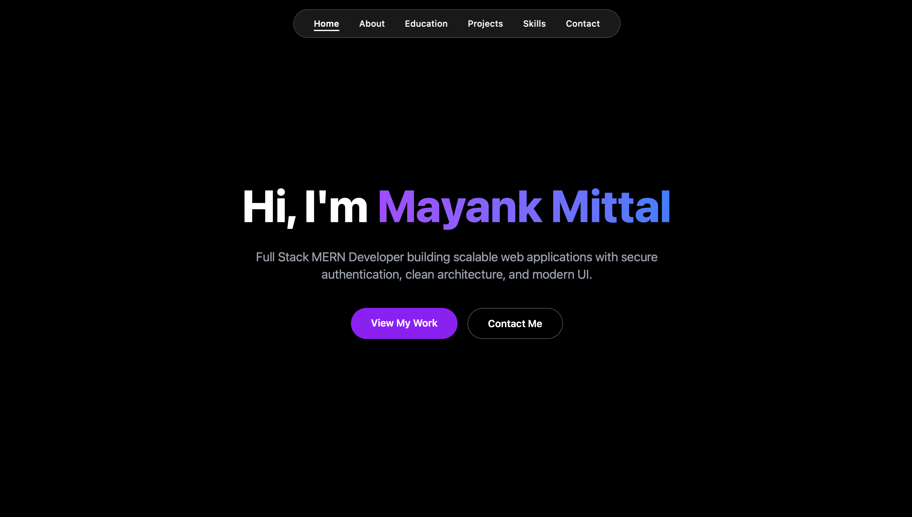
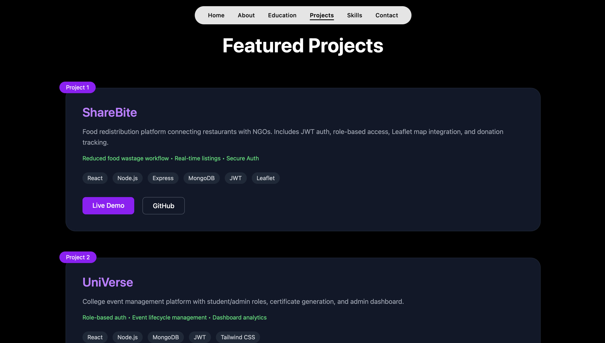
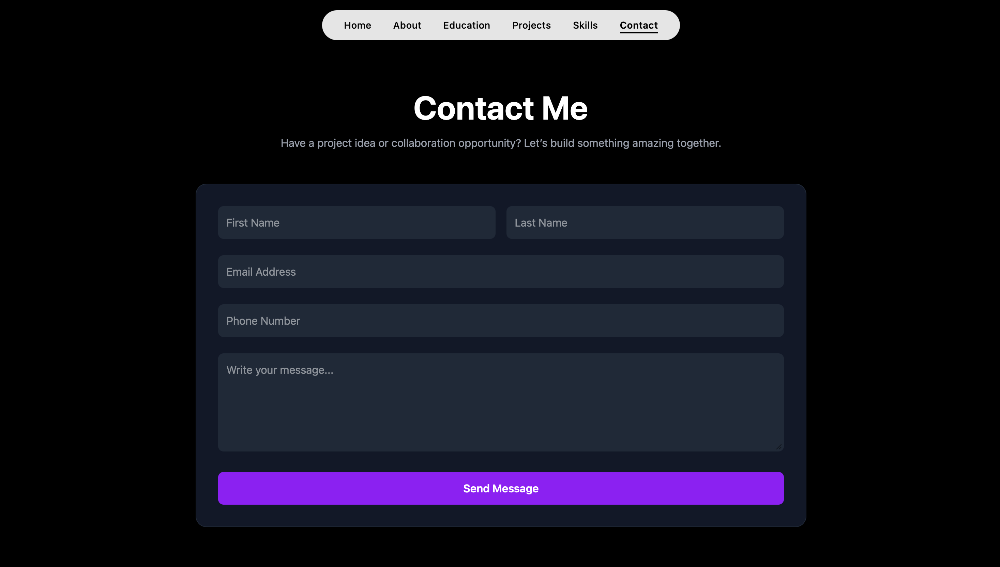

<h1 align="center">🚀 Mayank Mittal Portfolio</h1>

<p align="center">
  
</p>

<p align="center">
  
</p>

<p align="center">
<a href="https://portfolio-lake-nine-37.vercel.app">🌐 Live Demo</a> • 
<a href="https://github.com/mayank30092">GitHub</a> • 
<a href="https://linkedin.com/in/mayankmittal30092">LinkedIn</a>
</p>

---


---

# 🌐 Live Website

👉 https://portfolio-lake-nine-37.vercel.app

---

# 📌 About The Project

This is my **personal developer portfolio website** built to showcase:

* My projects
* Technical skills
* Experience
* Contact information

The website includes a **fully functional backend contact system** where visitors can send messages directly to my email using **Nodemailer**.

---

# ✨ Key Features

* ✔️ Modern responsive UI
* ✔️ Built with **React + Vite**
* ✔️ Serverless
* ✔️ Contact form integrated with **Resend**
* ✔️ Deployed using **Vercel and Render**
* ✔️ Optimized performance and clean design

---

# 🛠️ Tech Stack

<p align="center">

</p>

---

# 📂 Project Structure

```text
portfolio
│
├── screenshots
│   ├── Home.png
│   ├── Projects.png
│   └── Contact.png
│
├── src
│   ├── components
│   ├── sections
│   ├── assets
│   └── App.jsx
│
├── api
│   ├── server.js
│   └── health.js
│
├── lib
│    ├── rateLimit.js
│
└── README.md
```

---

# 📸 Screenshots

### Home Page

<p align="center">
  
</p>

### Projects Section

<p align="center">
  
</p>

### Contact Section

<p align="center">
  
</p>

---

# 🚀 Featured Projects

### 🌐 Portfolio Website

A modern portfolio built using **React,TailwindCss and Resend**.

### ☁️ Weather App

A responsive weather application built with **React and external APIs**.

### 🚗 Smart Parking IoT System

An IoT-based smart parking system using **ESP32 sensors and a web dashboard**.

---

# ⚙️ Environment Variables

Create a `.env` file inside the backend directory.

```env
RECEIVER_EMAIL=your_email@gmail.com
RESEND_API_KEY=your_API_Key
```

---

# 🚀 Run Locally

### Clone the repository

```bash
git clone https://github.com/mayank30092/YOUR_REPOSITORY.git
```

### Install dependencies

```bash
npm install
npm run dev
```
---

# 👨‍💻 Author

**Mayank Mittal**

Passionate about building **modern web applications, scalable systems, and IoT solutions.**

---

# 📫 Connect With Me

🌐 Portfolio
https://portfolio-lake-nine-37.vercel.app

💻 GitHub
https://github.com/mayank30092

💼 LinkedIn
https://linkedin.com/in/mayankmittal30092

---

⭐ If you like this project, consider giving it a **star on GitHub**!
